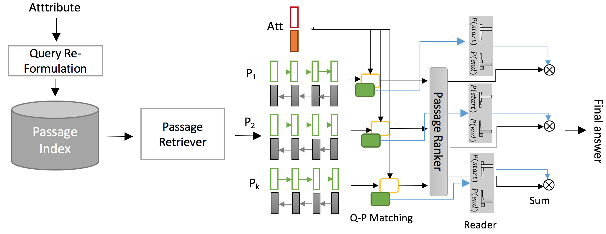

CQA
---
Value extraction based on some interested
attributes from text collection is an crucial
task in clinical domain. Previous work
often consider the task in a closed-world
context, assuming a single relevant passage
is given or in a restricted scope (e.g.,
value extraction from summary records).
However, for clinical scientific papers, relevant
passages are often unknown and retrieving
them is not at all a trivial task.
Thus, selecting the right value (that involves
many similar candidates) from the
open scope is very challenging. To address
this problem, we propose an end-toend
neural model that enables those answer
candidates from different passages
to compete with each other in a ranking
manner. Specifically, we jointly train
the passage ranking with our passage-level
value extraction component. Thus, the
answer selection mechanism can as well
take into account the cross-passage clues.

The code-base is refactored and extended from the DrQA implementation.

### Requirements
- python >= 3.5
- numpy
- pytorch 0.4
- msgpack
- spacy 1.x

### Dataset
The model can work with the SQuAD dataset, but it is mainly tailored to our custom clinical domain dataset.
We will publicize (a part of) the dataset later.

